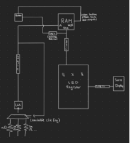
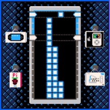

Digital Logic Design Final Project: Stacker

Zidane Karim, Christos Sarris, Wilson Li

The Skibidi Toilets

November 19, 2024

1  Purpose

Our project involves designing a game where the objective is to stack “blocks” represented by LEDs on top of each other. The gameplay mechanics are as follows:

- A block moves continuously from left to right.
- The player presses a button to stop the block, which then drops onto the stack.
- The player’s goal is to stack as many blocks as possible without allowing a block to fall off the stack.

The game features:

- Two input buttons: a game start button and a block drop button.
- LED outputs to represent the stacked blocks.
- A score display to show the player’s progress.

The challenge of the game comes from the fact that the block moves continuously, and the player must time their button press correctly to stack the blocks. The length of the blocks could also be 2 blocks wide, so the player would have more opportunities to stack the blocks but also more places to lose the blocks off of. The game ends when the player reaches the top, or if the player loses all their current blocks to the void.

2  Components

The key subcircuits we will be using are:

- LED matrix to represent the blocks.
- A bouncing counter to move the blocks back and forth.
- A button debouncer to handle the player’s input.
- A score counter to keep track of the player’s progress with a 7-segment display.
- A game over detector to end the game when the player loses, coupled with a speaker for sound effects during invalid inputs.
- Reading to the least significant address of a RAM block to check for collisions.
- Writing to the RAM block to store the player’s progress/position.
- Continously reading from the RAM block to update the LED matrix.
3  Design and Diagrams

Figure 1: Block Diagram of the Stacker Game

Figure 2: Stacker Game Layout

4  Schedule
- Monday, 11/25, Logisim for the clock, making the LED array, and the variable clock frequency logic
- Monday, 12/2, Wiring for clock, LED array, variable frequency. Logisim for the debounced button, and the logic to store the LED outputs of a button press onto the RAM
- Monday, 12/9, Wiring for the debounced button, and the logic to store the LED outputs of a button press onto the RAM, Logisim for the logic to initialize each row at startup, and the logic that displays the LED outputs from the RAM onto the LED array.
- Friday, 12/13 Wiring for the logic to initialize each row at startup, and the logic that displays the LED outputs from the RAM onto the LED array. Logisim for the score display with 7 segment LEDs and the logic to display the score
2
